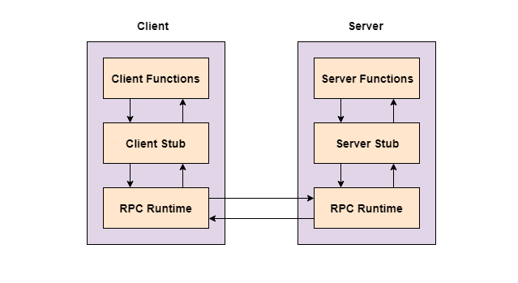

# RPC 介绍

##  什么是 RPC

RPC 是远程过程调用（ Remote Procedure Call ） 的缩写形式。

比较官方的说法是： 

一种通过网络从远程计算机程序上请求服务，而不需要了解底层网络技术的协议。RPC协议假定某些传输协议的存在，如TCP或UDP，为通信程序之间携带信息数据。在OSI网络通信模型中，RPC跨越了传输层和应用层。RPC使得开发包括网络分布式多程序在内的应用程序更加轻易。

##  与 LPC、 IPC 等的区别

首先 IPC 指的是进程间通信，在概念上与两者有区别

有两种类型的 IPC 通信方式

LPC 本地过程调用，用在多任务操作系统中，使得同时运行的任务能互相会话。这些任务共享内存空间使任务同步和互相发送信息。

RPC 类似于 LPC， 不过 RPC 需要在网络上进行工作， 用作 两台不同服务器 A、 B，  一个部署在A 服务器上的应用希望调用 B 服务器上应用提供的函数/方法， 需要通过网络来表达调用的语义和传达调用的数据。

RPC 希望做到在不同的机器之间，调用 函数/方法 也能像本机应用调用一样方便。

##  实现 RPC 协议

一个完整的 RPC 架构里面包含了四个核心的组件， 分别为

客户端（Client）， 服务调用方

服务端（Server）， 服务提供方

客户端存根（ClientStub）， 存放服务端的地址消息，再将客户端的请求参数打包成网络消息，然后通过网络远程发送给服务方。

服务端存根（ServerStub），接收客户端发送过来的消息，将消息解包，并调用本地的方法

RPC采用客户机/服务器模式。请求程序就是一个客户机，而服务提供程序就是一个服务器。首先，调用进程发送一个有进程参数的调用信息到服务进程，然后等待应答信息。在服务器端，进程保持睡眠状态直到调用信息的到达为止。当一个调用信息到达，服务器获得进程参数，计算结果，发送答复信息，然后等待下一个调用信息，最后，客户端调用过程接收答复信息，获得进程结果，然后调用执行继续进行。

RPC信息协议由两个不同结构组成：调用信息和答复信息。

那么实现一个 RPC 框架， 我们需要做哪些工作？

假设你现在需要调用一个方法

User getUserById(int id);

那么，

1. 第一步需要解决网络通信的问题， 毕竟归根结底我们是需要调用另外一台机器上的应用服务。所以首先我们需要在客户端与服务端之间建立一个通信管道， UDP 和 TCP 都可以， 但是在这种对于数据可靠性要求高的场景下，一般选择TCP。 连接可以是按需连接， 调用结束后就断开。 或者是建立一个长连接，来进行多路复用。 此时需要解决网络寻址问题， 也就是说 A 服务器上的应用需要告诉 底层RPC 框架如何连接到 B服务器， 以及连接上后需要调用哪个方法。

2. 第二步 序列化与反序列化， 由于在网络中传输，数据都会转换成二进制数据， 所以在 A 服务器上RPC 框架需要将参数值转换成二进制， 而在 B 服务器上 需要将二进制数据 反序列化成具体参数，调用本机上的应用方法。

3. 第三步 ， Call ID 映射。 A 服务器上想要调用 B 服务器的 函数方法， 但是两者又是如何保证调用者想要调用的方法是提供者提供的这个方法呢， 所以在 A 、B 端分别都要存储一个 函数 <-> Call ID 的映射表， 网络传输时通过 Call ID 传输， 到达服务器上， 两端分别进行查表获取真正需要调用的方法名。 所以这个 Call ID 在所有进程中必须是唯一的， 需要保证两者的映射关系的唯一性。

## RPC 框架

下面介绍一个常用的 RPC 框架， 看看它们是如何实现上述流程的。

### Dubbo

首先来看 Dubbo 框架的整体设计

#### 各层说明

- config 配置层：对外配置接口，以 ServiceConfig, ReferenceConfig 为中心，可以直接初始化配置类，也可以通过 spring 解析配置生成配置类

- proxy 服务代理层：服务接口透明代理，生成服务的客户端 Stub 和服务器端 Skeleton, 以 ServiceProxy 为中心，扩展接口为 ProxyFactory

- registry 注册中心层：封装服务地址的注册与发现，以服务 URL 为中心，扩展接口为 RegistryFactory, Registry, RegistryService

- cluster 路由层：封装多个提供者的路由及负载均衡，并桥接注册中心，以 Invoker 为中心，扩展接口为 Cluster, Directory, Router, LoadBalance

- monitor 监控层：RPC 调用次数和调用时间监控，以 Statistics 为中心，扩展接口为 MonitorFactory, Monitor, MonitorService

- protocol 远程调用层：封装 RPC 调用，以 Invocation, Result 为中心，扩展接口为 Protocol, Invoker, Exporter

- exchange 信息交换层：封装请求响应模式，同步转异步，以 Request, Response 为中心，扩展接口为 Exchanger, ExchangeChannel, ExchangeClient, ExchangeServer

- transport 网络传输层：抽象 mina 和 netty 为统一接口，以 Message 为中心，扩展接口为 Channel, Transporter, Client, Server, Codec

- serialize 数据序列化层：可复用的一些工具，扩展接口为 Serialization, ObjectInput, ObjectOutput, ThreadPool

我们来看下上述实现 RPC 框架时， 需要做哪些事情
1. 序列化 和 反序列化
2. Call ID - 方法 映射
3. 地址寻址
4. 网络通信

首先 Dubbo 在 `serialize 数据序列化层` 提供了基础的序列化和反序列化能力，
这部分主要是一些公共方法， 不展开细讲。

其次就是 `Call ID - 方法 映射` , 这部分操作在 `proxy 层` 实现,  如下图所示，

服务提供

通过配置 获取到服务类后， 使用 ProxyFactory 生成 Invoker 实例， 在将该实例封装上某种网络通信协议， 已提供其网络通信能力。

服务消费

当请求消息进入后， 再使用特定的协议栈将其转化成 invoker 实例， 通过 proxy 映射到具体的服务实现类，进行方法调用。

整体流程

再就是 `地址寻址`，在如今微服务架构盛行下， 不同的服务往往都是部署在不同的机器上， 分别提供不同的服务地址， 此时就需要有一个注册中心来 管理这些服务地址， 目前用的比较多的是 Zookeeper。

Zookeeper 是 Apacahe Hadoop 的子项目，是一个树型的目录服务，支持变更推送，适合作为 Dubbo 服务的注册中心，

流程说明：

- 服务提供者启动时: 向 /dubbo/com.foo.BarService/providers 目录下写入自己的 URL 地址
- 服务消费者启动时: 订阅 /dubbo/com.foo.BarService/providers 目录下的提供者 URL 地址。并向 /dubbo/com.foo.BarService/consumers 目录下写入自己的 URL 地址
- 监控中心启动时: 订阅 /dubbo/com.foo.BarService 目录下的所有提供者和消费者 URL 地址。

最后就是 `网络通信` 了， Dubbo 由 `transport 网络传输层` 和 `exchange 信息交换层` 来提供通信协议封装和网络通信能力。

                                                                                                                             
## 拓展 （Spring Cloud）

对这两个框架的使用经验和理解，打个不恰当的比喻：使用Dubbo构建的微服务架构就像组装电脑，各环节我们的选择自由度很高，但是最终结果很有可能因为一条内存质量不行就点不亮了，总是让人不怎么放心，但是如果你是一名高手，那这些都不是问题；而Spring Cloud就像品牌机，在Spring Source的整合下，做了大量的兼容性测试，保证了机器拥有更高的稳定性，但是如果要在使用非原装组件外的东西，就需要对其基础有足够的了解

# 参考

http://dubbo.apache.org/zh-cn/docs/dev/design.html