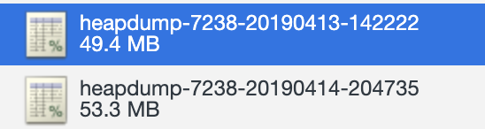
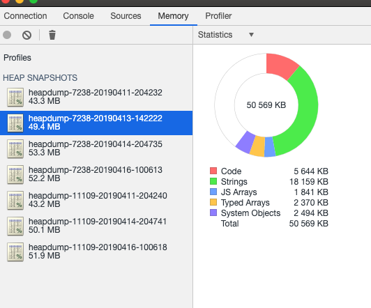
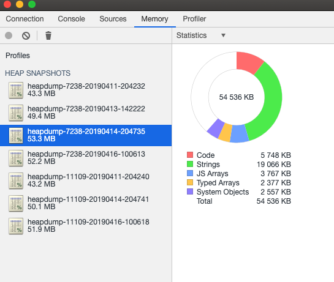
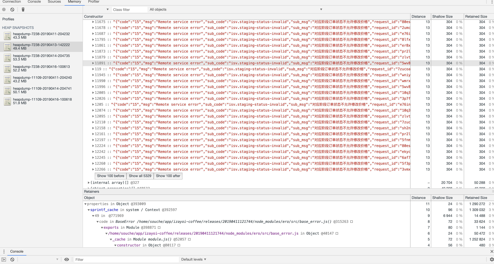
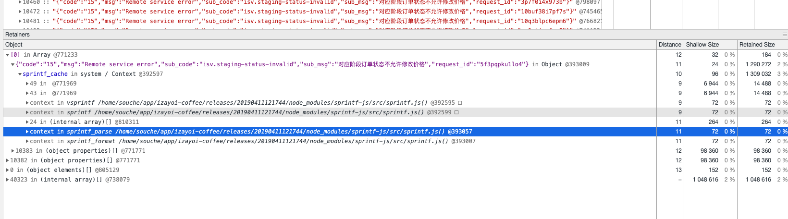
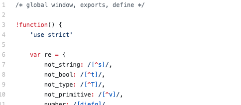
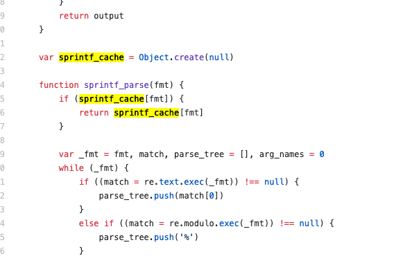

# NodeJs 内存泄漏案例分析

## 背景

组内的一个对外接口聚合项目，出现内存持续升高现象， 定位为程序出现内存泄漏问题。

## 分析过程

程序在内存泄漏期间，截取的几个内存快照

以下是我的分析过程

为了 独立性，这次我分析的是  izayoi-00001 机器上的两个快照
 

分析两个快照中的内存组成结构：

发现 JS Arrays 是这两个快照中主要的 内存增长点， 为 3767 - 1841 = 1926 KB

比对这两个快照同样发现，下图错误对象过多。

这个错误信息从 Show all 5329  中可以得 至少还有 5329多个， 一个 304 B， 那么这里的内存就高达 5329 * 304 / 1024 = 1582 KB。 
由此可得，此次的内存泄漏主要发生在 此处。

问题还是出在 sprintf.js 里， GitHub地址 

https://github.com/alexei/sprintf.js/blob/master/src/sprintf.js

...............省略中间部分........................

从源码上看，这个 sprintf_cache 对象创建的作用域在 全局作用域上，当 sprintf.js 这个模块被缓存时， 这个变量就不会被GC，从而导致 内存积压。

sprintf_cache 以 key 作为 是否存在缓存的判断， 目前项目中使用该包作为错误信息 的格式化， 但是错误信息内容基本都不重复，导致该缓存命中率极低。

解决方法：
1. 使用 lru-cache 这种 拥有缓存淘汰机制的模块 代替手动创建的对象， 实现缓存自动更新，防止内存积压。
2. 或者说直接去掉这个缓存逻辑， 如果异常信息中都携带了request_id ， 那么每次都是不一样的，没必要缓存。

最后关于如何使用 chrome 工具进行内存分析，可以参考之前写的一篇文章： https://github.com/M-jingxing/Technique-sharing-/blob/master/nodejs-debugger%2Bchrome%E5%AE%9E%E7%8E%B0%E8%B0%83%E8%AF%95%E5%8F%8A%E5%86%85%E5%AD%98%E5%88%86%E6%9E%90.md