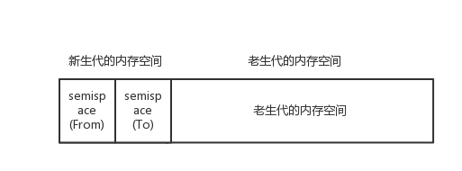
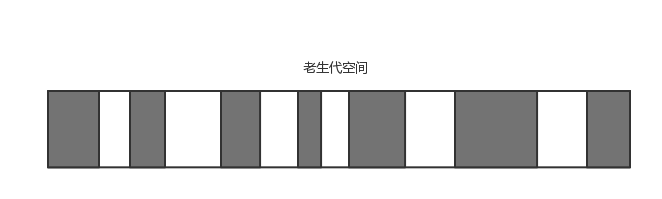
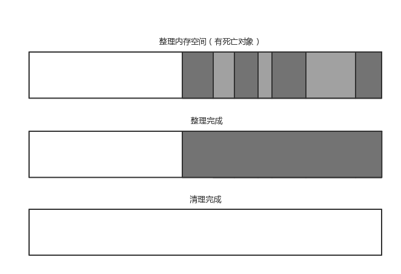

# nodejs 内存管理机制

首先 **内存** 是什么， 维基百科定义 随机存取存储器，也叫主存，是与CPU直接交换数据的内部存储器。它可以随时读写，而且速度很快，通常作为操作系统或其他正在运行中的程式的临时资料存储媒介。

在cpu工作时可以直接进行数据交互的存储器， 所以在内存中的数据读写速度的非常快的， 这也保证了程序运行时的性能。
在V8中所有JavaScript对象都是通过**堆**来进行分配的

注： 堆（英语：Heap）是计算机科学中的一种特别的树状数据结构。若是满足以下特性，即可称为堆：“给定堆中任意节点 P 和 C，若 P 是 C 的母节点，那么 P 的值会小于等于（或大于等于） C 的值”， 故堆有最小堆与最大堆

## V8 的内存限制

在一般的后端开发语言中，对内存的使用并没有什么限制，但是node通过JavaScript使用的内存只能有一部分（在64位的系统中大概1.4GB， 32位0.7GB），是故在node单进程的情况下，对内存的使用需要更加的谨慎了，因为本来能提供给你使用的就不多。

作为一门服务端开发语言，Node 可以说是享受到了V8的高性能的同时，同时也被V8限制了很多。 

但是V8也提供了启动参数，来打开部分限制，
> node --max-old-space-size=1024 main.js // 设置老生代内存 单位MB

> node --max-new-space-size=1024 main.js // 设置新生代内存 单位KB

## V8 的垃圾回收机制 （GC）

V8的垃圾回收策略主要基于「分代式垃圾回收机制」，基于这个机制，V8把内存分为「新生代(New Space)」和 「老生代 (Old Space)」。
新生代中的对象为存活时间较短的对象，老生代中的对象为存活时间较长或常驻内存的对象。
前面提及到的`--max-old-space-size`命令就是设置老生代内存空间的最大值，而`--max-new-space-size`命令则可以设置新生代内存空间的大小。

比较遗憾的是 这两个最大值需要在启动的时候就指定，无法根据实际使用情况自动扩充。

### 新生代中的垃圾回收
在新生代中主要通过Scavenge算法进行垃圾回收

#### Scavenge

在Scavenge算法中，它将堆内存一分为二，每一部分空间称为semispace。在这两个semispace空间中，只有一个处于使用中，另外一个处于闲置状态。处于使用状态的semispace称为From空间，处于闲置状态的semispace称为To空间。当我们分配对象时，先是从From空间中分配。当开始进行垃圾回收时，会检查From空间中存活的对象，这些存活的对象会被复制到To空间中，而非存活的对象占用的空间会被释放。完成复制后，**From空间和To空间角色互换**。简而言之，在垃圾回收的过程中，就是通过将存活对象在两个semispace空间之间进行复制。

当内存对象经历过一次 Scavenge 回收后但是该内存空间并未被释放，即从From 复制到 To 空间后 仍然存在的，将会转移至 老生代内存中。
又或者说是 To空间的内存占比已经到25% 这个限制，那么新增加的这个对象将会自动移动到老生代的空间中， 防止To空间占比过高影响后续的内存分配。

那么老生代的内存对象又是如何回收的呢

### 老生代中的内存回收

在老生代，存活对象占的比重比较大，使用 `Mark-Sweep` 算法与`Mark-Commpact` 算法相结合的方式进行垃圾回收。

#### Mark-Sweep

Mark-Sweep是标记清除的意思，分为标记和清除两个阶段。在标记阶段遍历堆中的所有对象，并标记存活的对象，在随后的清除阶段中，只清除标记之外的对象。
但是Mark-Sweep 由于清除的内存对象不一定连续，可能会导致清除回收后内存空间产生很多碎片空间，将无法再分配较大的空间给大对象。所以此时结合Mark-Commpact 算法来整理空间。

#### Mark-Commpact

Mark-Compact是标记整理的意思，是在Mark-Sweep基础上演变而来。Mark-Compact在标记存活对象之后，在整理过程中，将活着的对象往一端移动，移动完成后，直接清理掉边界外的内存。

### Incremental Marking

虽然结合之前的内存回收算法，已经可以比较好的实现GC，但是Node的事件循环都是在一个单线程中实现的，当V8进行GC动作时，必然阻塞了js的事件循环，所以V8做了一个叫Incremental Marking的算法优化。

「增量标记 (Incrememtal Marking)」。它从标记阶段入手，将原本要一口气停顿完成的动作改为增量标记，拆分为许多小「步进」，每做完一「步进」就让JavaScript应用逻辑执行一小会，垃圾回收与应用逻辑这样交替执行直到标记阶段完成。

尽管如此， 一次V8 GC回收，还是会对性能产生一定程度的影响，所以对代码进行一定程度的优化，尽量减少V8 GC的耗时才是正确使用node 的方式。

## 如何优化代码
     

## 内存泄漏排查工具

查看nodejs-debugger + chrome性能调优 一章