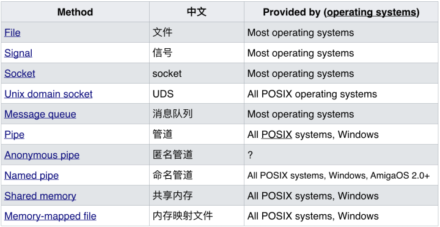

# 引言

当我们谈起 nodejs 时，由于 JavaScript 只能在单线程上运行， 导致 一个 Node 进程只能运行在一个CPU上， 无法发挥现代 CPU 多核的特性。
这对于一个 服务端语言来说， 是比较掣肘其发展的。 好在 Node 在 v0.10 后， 可以使用 Cluster 模块搭建 多进程服务， 并在 v0.12 重写了该模块，
大幅提高其性能， 下面我们将走进 Node-Cluster ，看看 Node 是如何实现集群的。

# 多进程单线程 与 单进程多线程 模型

首先，这涉及一个 程序设计 的两种模型
本文提及的 Nodejs 便是使用 `多进程单线程` 实现的， 而 Java 等语言 则使用 `单进程多线程` 模型
故本文着重 `多进程单线程` 模型， 至于 `单进程多线程` 模型，则会在比较中稍微涉及。

## 多进程单线程

正如上文说到， JavaScript 只能在单线程中运行， 故 Node 在 JS层面只能 在某进程的一个线程中运行。
若要实现集群， 则必须创建多个进程， 以实现多个应用实例同时运行。

Cluster 模块， 提供了 master-worker 模式 启动多个应用模式。
接下来我们就走入这个模块， 看看其内部具体做了哪些事情。

# Cluster

Cluster 是什么？

1. 在服务器上启动多个进程
2. 每个进程里都跑的同一份代码
3. 每个进程竟然还能监听同一个端口 （下文分析实现原理）

其中：

1. 负责启动其他进程的叫做 Master 进程，他好比是个『包工头』，不做具体的工作，只负责启动其他进程。
2. 其他被启动的叫 Worker 进程，顾名思义就是干活的『工人』。它们接收请求，对外提供服务。
3. Worker 进程的数量一般根据服务器的 CPU 核数来定，这样就可以完美利用多核资源。

```
const cluster = require('cluster');
const http = require('http');
const numCPUs = require('os').cpus().length;

if (cluster.isMaster) {
  // Fork workers.
  for (let i = 0; i < numCPUs; i++) {
    cluster.fork();
  }

  cluster.on('exit', function(worker, code, signal) {
    console.log('worker ' + worker.process.pid + ' died');
  });
} else {
  // Workers can share any TCP connection
  // In this case it is an HTTP server
  http.createServer(function(req, res) {
    res.writeHead(200);
    res.end("hello world\n");
  }).listen(8000);
}

```

## worker 进程的创建

使用 Cluster 模块的 fork 方法来创建出子进程

```
cluster.fork();
```

先从 worker 进程的初始化开始看， master 进程在 fork 其 worker进程时 会在其环境变量（workerEnv）中 附加上一个 唯一ID（NODE_UNIQUE_ID）
该ID 是一个从 0 开始的递增数。

```
var ids = 0;

//.....

cluster.fork = function(env) {
  cluster.setupMaster();
  const id = ++ids;
  const workerProcess = createWorkerProcess(id, env);
  const worker = new Worker({
    id: id,
    process: workerProcess
  });

// ....

function createWorkerProcess(id, env) {
  const workerEnv = util._extend({}, process.env);
  const execArgv = cluster.settings.execArgv.slice();
  const debugArgRegex = /--inspect(?:-brk|-port)?|--debug-port/;

  util._extend(workerEnv, env);
  workerEnv.NODE_UNIQUE_ID = '' + id;

  // .....

  return fork(cluster.settings.exec, cluster.settings.args, {
    cwd: cluster.settings.cwd,
    env: workerEnv,
    silent: cluster.settings.silent,
    windowsHide: cluster.settings.windowsHide,
    execArgv: execArgv,
    stdio: cluster.settings.stdio,
    gid: cluster.settings.gid,
    uid: cluster.settings.uid
  });
}
```

然后 Node 在实例初始化时，使用该 ID 判断使用 clild.js Or master.js

```
const childOrMaster = 'NODE_UNIQUE_ID' in process.env ? 'child' : 'master';
module.exports = require(`internal/cluster/${childOrMaster}`);

```

把目光再集中到 这个 `fork()` 函数中来，

```
exports.fork = function(modulePath /*, args, options*/) {

  // Get options and args arguments.
  var execArgv;
  var options = {};
  var args = [];
  var pos = 1;
  if (pos < arguments.length && Array.isArray(arguments[pos])) {
    args = arguments[pos++];
  }

  if (pos < arguments.length && arguments[pos] != null) {
    if (typeof arguments[pos] !== 'object') {
      throw new TypeError('Incorrect value of args option');
    }

    options = util._extend({}, arguments[pos++]);
  }

  // Prepare arguments for fork:
  execArgv = options.execArgv || process.execArgv;

  if (execArgv === process.execArgv && process._eval != null) {
    const index = execArgv.lastIndexOf(process._eval);
    if (index > 0) {
      // Remove the -e switch to avoid fork bombing ourselves.
      execArgv = execArgv.slice();
      execArgv.splice(index - 1, 2);
    }
  }

  args = execArgv.concat([modulePath], args);

  if (typeof options.stdio === 'string') {
    options.stdio = stdioStringToArray(options.stdio);
  } else if (!Array.isArray(options.stdio)) {
    // Use a separate fd=3 for the IPC channel. Inherit stdin, stdout,
    // and stderr from the parent if silent isn't set.
    options.stdio = options.silent ? stdioStringToArray('pipe') :
      stdioStringToArray('inherit');
  } else if (options.stdio.indexOf('ipc') === -1) {
    throw new TypeError('Forked processes must have an IPC channel');
  }

  options.execPath = options.execPath || process.execPath;
  options.shell = false;

  return spawn(options.execPath, args, options);
};

```
在函数中 做了一些 参数准备，而重点在于 对 这个 `options.stdio` 的处理。

`options.stdio` 用于配置子进程与父进程之间建立的管道， 其值应该为一个数组， 但是为了方便， 值可以是以下的字符串之一： 

`'pipe' - 等同于 ['pipe', 'pipe', 'pipe'] （默认）`

`'ignore' - 等同于 ['ignore', 'ignore', 'ignore']`

`'inherit' - 等同于 [process.stdin, process.stdout, process.stderr] 或 [0,1,2]`

其每个值 分别对应 `[process.stdin, process.stdout, process.stderr]`  标准输入、标准输出、标准错误 输出到父进程的方式。

而使用 Fork 方式 衍生出的子进程，又必须加上 一个 `IPC通道` 用于父子间 传递消息或文件描述符, 故 `stdioStringToArray` 函数代码如下

```
function stdioStringToArray(option) {
  switch (option) {
    case 'ignore':
    case 'pipe':
    case 'inherit':
      return [option, option, option, 'ipc'];
    default:
      throw new TypeError('Incorrect value of stdio option: ' + option);
  }
}
```

## 多进程之间 的 进程间通信

下面我们就重点来看，这个 `IPC通道` 是如何实现的，以及其工作原理

进程间通信（Inter-process communication, IPC）其实是个很简单的概念，只要你将这个进程的数据传到 另外一个进程就是 `IPC` 了， 要实现 这个数据传递的方式有非常的多， 如以下



在 Node 中 `IPC` 实现分两种， 在 Windows 上通过 命名管道， 在 UNIX 上则使用 
`UNIX domain sockets`(UDS), 详情参见 [官方文档](https://nodejs.org/dist/latest-v10.x/docs/api/net.html#net_ipc_support) 

目前 Linux 还是主流的服务端操作系统， 主要分析下在 Linux 下 UDS 的使用方式

UDS 是在 Socket 的基础上发展而来的， Socket 一般我们指的都是 `IP Socket`, 通过网络协议进行通信， 但是在同一台设备上的通信，是否可以绕开网络层的限制呢。 这里我们就可以通过 UDS 来实现， 所以把 它称之为 `LocalSocket` ，看起来更贴切一点。

在 Linux 中， 一切都可以当做是 文件。 UDS 也不例外。

在 Node 的 child_process.js 模块中， 有如下代码

```
stdio = stdio.reduce(function(acc, stdio, i) {
  // ......
else if (stdio === 'ipc') {
      if (sync || ipc !== undefined) {
        // Cleanup previously created pipes
        cleanup();
        if (!sync)
          throw new errors.Error('ERR_IPC_ONE_PIPE');
        else
          throw new errors.Error('ERR_IPC_SYNC_FORK');
      }

      ipc = new Pipe(PipeConstants.IPC);
      ipcFd = i;

      acc.push({
        type: 'pipe',
        handle: ipc,
        ipc: true
      });
    }
```

当 stdio 的 类型为 `ipc` 时，会创建一个 ipc 管道， 其fd 为 'ipc' 在stdio数组 中的索引
```
ipc = new Pipe(PipeConstants.IPC);
ipcFd = i;
```

此时目光应该被这个 `Pipe` 所吸引了吧， 那么它又是什么呢， 话不多少直接上 `libuv` 中对应 Pipe 的实现。


```
void PipeWrap::New(const FunctionCallbackInfo<Value>& args) {
  // This constructor should not be exposed to public javascript.
  // Therefore we assert that we are not trying to call this as a
  // normal function.
  CHECK(args.IsConstructCall());
  CHECK(args[0]->IsInt32());
  Environment* env = Environment::GetCurrent(args);

  int type_value = args[0].As<Int32>()->Value();
  PipeWrap::SocketType type = static_cast<PipeWrap::SocketType>(type_value);

  bool ipc;
  ProviderType provider;
  switch (type) {
    case SOCKET:
      provider = PROVIDER_PIPEWRAP;
      ipc = false;
      break;
    case SERVER:
      provider = PROVIDER_PIPESERVERWRAP;
      ipc = false;
      break;
    case IPC:
      provider = PROVIDER_PIPEWRAP;
      ipc = true;
      break;
    default:
      UNREACHABLE();
  }

  new PipeWrap(env, args.This(), provider, ipc);
}


PipeWrap::PipeWrap(Environment* env,
                   Local<Object> object,
                   ProviderType provider,
                   bool ipc)
    : ConnectionWrap(env, object, provider) {
  int r = uv_pipe_init(env->event_loop(), &handle_, ipc);
  CHECK_EQ(r, 0);  // How do we proxy this error up to javascript?
                   // Suggestion: uv_pipe_init() returns void.
  UpdateWriteQueueSize();
}

```
```
int uv_pipe_init(uv_loop_t* loop, uv_pipe_t* handle, int ipc) {
  uv__stream_init(loop, (uv_stream_t*)handle, UV_NAMED_PIPE);
  handle->shutdown_req = NULL;
  handle->connect_req = NULL;
  handle->pipe_fname = NULL;
  handle->ipc = ipc;
  return 0;
}
```
```
void uv__stream_init(uv_loop_t* loop,
                     uv_stream_t* stream,
                     uv_handle_type type) {
  int err;

  uv__handle_init(loop, (uv_handle_t*)stream, type);
  stream->read_cb = NULL;
  stream->alloc_cb = NULL;
  stream->close_cb = NULL;
  stream->connection_cb = NULL;
  stream->connect_req = NULL;
  stream->shutdown_req = NULL;
  stream->accepted_fd = -1;
  stream->queued_fds = NULL;
  stream->delayed_error = 0;
  QUEUE_INIT(&stream->write_queue);
  QUEUE_INIT(&stream->write_completed_queue);
  stream->write_queue_size = 0;

  if (loop->emfile_fd == -1) {
    err = uv__open_cloexec("/dev/null", O_RDONLY);
    if (err < 0)
        /* In the rare case that "/dev/null" isn't mounted open "/"
         * instead.
         */
        err = uv__open_cloexec("/", O_RDONLY);
    if (err >= 0)
      loop->emfile_fd = err;
  }

#if defined(__APPLE__)
  stream->select = NULL;
#endif /* defined(__APPLE_) */

  uv__io_init(&stream->io_watcher, uv__stream_io, -1);
}
```

可以看到对应 ipc 管道， 底层是通过文件流的方式实现的。
那么这个管道 就一样拥有 和 stream 一样的模式，即 `open—write/read—close`

父进程在实际创建子进程前，会创建IPC通道并监听它，然后才真正创建出子进程，并通过环境变量（NODE_CHANNEL_FD）告诉子进程这个IPC通信的文件描述符（fd）。子进程在启动的过程中，根据文件描述符去连接这个已存在的IPC通道，从而完成父子进程之间的连接。

当父进程 send 数据到子进程时， 便通过这个 fd 向 这个特殊的文件开始写入数据，此时调用底层stream 的 write 方法，而子进程由于在启动的过程中便已经连接上 该通道， 在应用层通过 message 事件（底层应是 stream 的 read方法），来接收数据。

由于这个IPC通道是 双工通信的， 故子进程也可以实现向父进程通信。


# 问题解析
## 多进程之间是如何实现 端口共享的？

那么 node 又是如何实现多进程 监听同一个端口呢，这里的关键在于 `句柄传递`。

如下代码：

```
//主进程代码

var child = require('child_process').fork('child.js');
// Open up the server object and send the handle
var server = require('net').createServer();
server.on('connection', function (socket) {
    socket.end('handled by parent\n');
});
server.listen(1337, function () {
    child.send('server', server);
});

//子进程代码
process.on('message', function (m, server) {
    if (m === 'server') {
        server.on('connection', function (socket) {
            socket.end('handled by child\n');
        });
    }
});
```
在示例中，父进程直接将创建出来的 Tcp对象 传递到子进程中，但是我们知道两个进程之间又是无法直接共享内存的， 那么这又是怎么实现的呢？


来看这个 send方法

```
child.send(message, [sendHandle])
```

目前，子进程对象send()方法可以发送的句柄类型包括如下几种：

1.net.socket，tcp套接字

2.net.Server，tcp服务器，任意建立在tcp服务上的应用层服务都可以享受到它带来的好处。

3.net.Native，c++层面的tcp套接字或IPC管道。

4.dgram.socket，UDP套接字

5.dgram.Native，C++层面的UDP套接字

send()方法在将消息发送到IPC管道前，将消息组装成两个对象，一个参数是handle，另一个是message, 而发送到子进程的 实际上是这个句柄的 文件描述符， message对象也会序列化为字符串。

而子进程由于之前连接了IPC通道， 可以读取到父进程发送的消息。获取到这个消息后， 通过JSON.parse 还原为对象， 并分析 其中的cmd值， 若 message.cmd = NODE_HANDLE, 则表示父进程传递的是一个句柄，此时便会通过 获取到的 fd 和传递的句柄类型，还原出这个Tcp对象。

还原出这个server 对象后， 便是去监听这个端口了。

```
setsockopt(tcp->io_watcher.fd, SOL_SOCKET, SO_REUSEADDR, &on, sizeof(on))
```
而在 libuv 中在 setsockopt 时设置了 SO_REUSEADDR 选项（关于这个选项的含义可以自行百度），简而言之，设置了这个选项后， 在Linux层面允许我们使用不同的进程 就相同的网卡和端口进行监听， 对于独立启动的进程，并不知道彼此的fd， 所以当一个进程监听成功后， 后面的进程便会失败，但是 通过 send 方式还原出来的 server对象，他们的fd是相同的，此时该子进程就可以通过这个fd 去监听这个端口。

但是 fd 在同一时刻只能被一个进程所占用， 换言之就是网络请求向服务器端发送时，只有一个幸运的进程能够抢到连接，也就是说只有他能为这个请求进行服务。这些进程也都是抢占式的。

# 总结

随着这些模块逐渐完善， Nodejs 在服务端的使用场景也越来越丰富，如果你仅仅是因为JS 这个后缀而注意到它的话， 那么我希望你能暂停脚步，好好了解一下这门年轻的语言，相信它会给你带来惊喜。

# 参考

https://github.com/nodejs/node

https://nodejs.org/dist/latest-v10.x/docs/api/net.html#net_ipc_support

https://www.jianshu.com/p/335a9e101c3f

http://docs.libuv.org/en/v1.x/stream.html